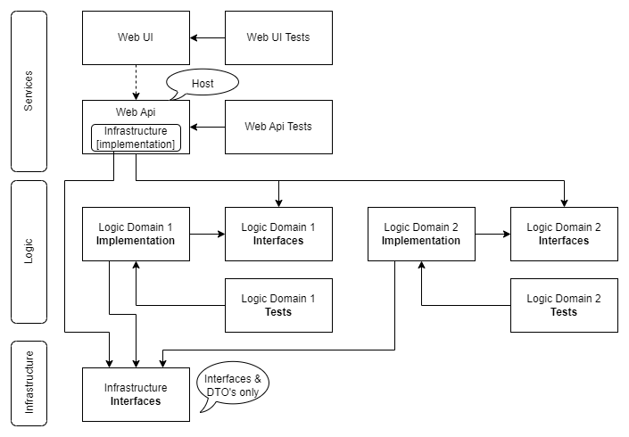

 

# Peereflits.Shared.Dependencies #

This repository contains the solution and a projects of `Peereflits.Shared.Dependencies`.

These components are a part of the infrastructural libraries of *Peereflits.Shared*.


## Goal

You build an application that has multiple projects within a VS solution. And as you try to apply the adagium "program agains abstractions, not concretions" [Uncle Bob] all your implementations expose an interface.
Now asp.net has default a dependency injection system built in.




The main goal of this project is to abstract dependency injection (DI) and validation and prevent that every project that uses DI need a dependency on/package reference to ``Microsoft.Extensions.DependencyInjection``.

-- to be continued

## Solution and projects

The solution has the following projects:

1. **Common.Dependencies.Interfaces**: an interface + types library.
   - Target Frameworks: net6.0, net7.0
   - AssemblyName: Peereflits.Shared.Dependencies.Interfaces
   - RootNamespace: Peereflits.Shared.Dependencies
   - Project References
      - None
   - Package References
      - None

1. **Common.Dependencies.Extensions**: the implementation library of `Common.Dependencies.Interfaces`.
   - Target Frameworks: net6.0, net7.0
   - AssemblyName: Peereflits.Shared.Dependencies.Interfaces
   - RootNamespace: Peereflits.Shared.Dependencies
   - Project References
      - `Common.Dependencies.Interfaces`
   - Package References
      - `Microsoft.Extensions.DependencyInjection.Abstractions`

1. **Common.Dependencies.Extensions.Tests**: the unit tests of `Common.Dependencies.Extensions`.
   - Target Frameworks: net6.0, net7.0
   - AssemblyName: Peereflits.Shared.Dependencies.Extensions
   - RootNamespace: Peereflits.Shared.Dependencies.Extensions
   - Project References
      - `Common.Dependencies.Extensions`
   - Package References
      - Several unittest framework libraries


## Examples

Recommend usage of this DI package is as follows: 

1. Each implementation project should have a ``TypeRegistrations`` class where all types of that project are registered, like: 
```` csharp
public class TypeRegistrations : IProvideTypeRegistrations
{
    public IEnumerable<TypeRegistration> Execute() 
        => new List<TypeRegistration>
        {
            // all interfaces and its implemtations should be registerred here.
            new TypeRegistration<IMyService, MyService>(Lifetime.Scoped),
            new TypeRegistration<IMyService>(() => { ...put your factory here... }, Lifetime.Scoped),
        };
}
````

2. Each implementation project should also have a ``TypeRegistrationRules`` class where all defined interfaces are listed this project depends on, like
```` csharp
public class TypeRegistrationRules : IProvideTypeRegistrationRules
{
    public IEnumerable<TypeRegistrationRule> Execute() 
        => new List<TypeRegistrationRule>
            {
                new TypeRegistrationRule<IMyService>(),
            };
}
````
The catch is, that you should also register here the interfaces the project depends on for witch it can't provide an implementation. 
There are cases where you can't know what an implementation will provide; it is information only a host or separate implementor knows when it uses your package.

The number of items in a list of type registration rules always equals or is larger than the list of type registrations.

3. In a host project there should be a ``TypeRegistrationResolver`` and a ``TypeRegistrationRulesResolver`` referencing all Common packages needed by the host, like:
```` csharp
internal class TypeRegistrationResolver : IProvideTypeRegistrations
{
    public IEnumerable<TypeRegistration> Execute()
    {
        var registrations = new List<IProvideTypeRegistrations>
                                {
                                    new Logic.Domain.One.TypeRegistrations(),
                                    new Logic.Domain.Two.TypeRegistrations(),
                                    new MyProject.TypeRegistrations()
                                };

        return new List<TypeRegistration>(registrations.SelectMany(x => x.Execute()));
    }
}

internal class TypeRegistrationRulesResolver : IProvideTypeRegistrationRules
{
    public IEnumerable<TypeRegistrationRule> Execute()
    {
        var providers = new List<IProvideTypeRegistrationRules>
                                {
                                    new Logic.Domain.One.TypeRegistrationRules(),
                                    new Logic.Domain.Two.TypeRegistrationRules(),
                                    new MyProject.TypeRegistrationRules()
                                };

        return new List<TypeRegistrationRule>(providers.SelectMany(x => x.Execute()));
    }
}
````

4. In the ``Startup`` class of the host in ``void ConfigureServices(IServiceCollection services)`` you can add these two lines that ties it all together:
```` csharp
    services.TypeRegistrations<TypeRegistrationResolver>()
            .Validate<TypeRegistrationRulesResolver>();
````


---

<p align="center">
&copy; No copyright applicable<br />
&#174; "Peereflits" is my codename.
</p>

---
